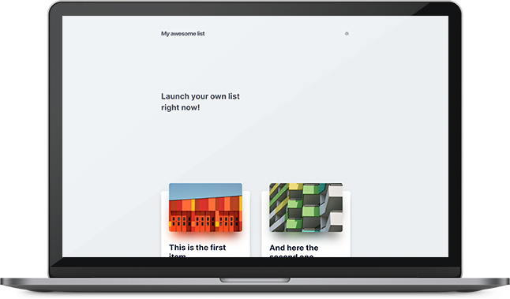

# <center>My awesome list</center>

<p align="center">
  
</p>

---

[](https://app.stackbit.com/create?theme=https://github.com/tunguskha/my-awesome-list)


### Start creating your own list now!

[My awesome list](https://github.com/tunguskha/my-awesome-list) is a custom theme for creating a site with a directory of websites using [stackbit](https://stackbit.com)

### One theme codebase converts to multiple Static Site Generators

This theme in particular is written in [Unibit](https://docs.stackbit.com/unibit/), a superset of static site generators. Unibit's powerful transpiling engine enables you to write once and stay SSG agnostic. Themes will automatically work with new generators as they are added and can currently convert to Jekyll, Hugo & Gatsby.

---

## Quickstart

### Unibit CLI

Develop locally using the Unibit CLI. 

```
npm install -g @stackbit/unibit
```

Start the local development server. 

```
unibit develop
```

Compile a production build into the `public` folder.

```
unibit build
```
